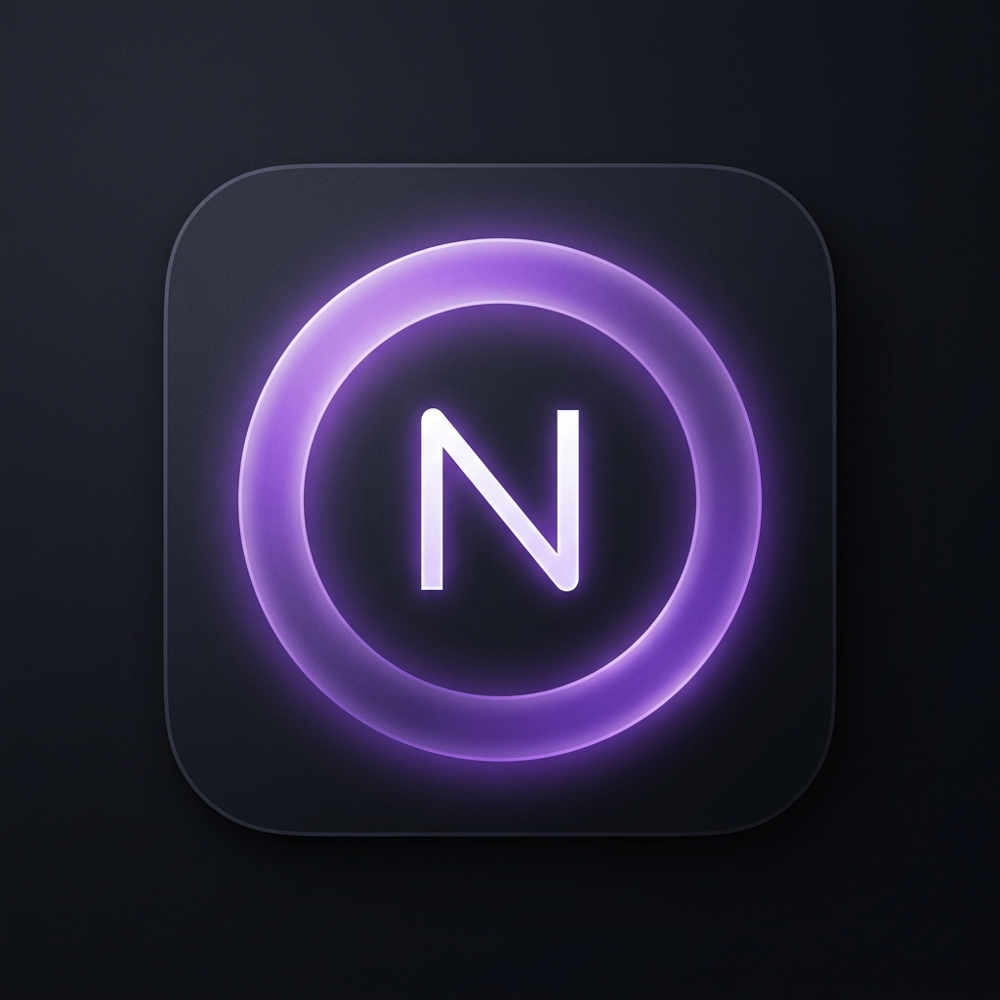
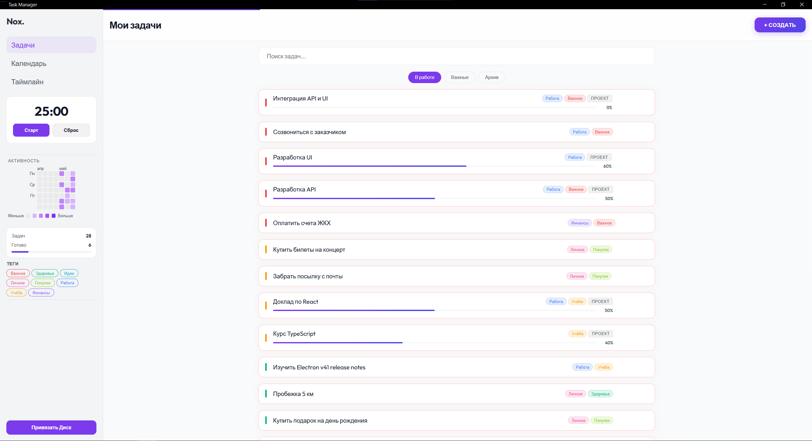
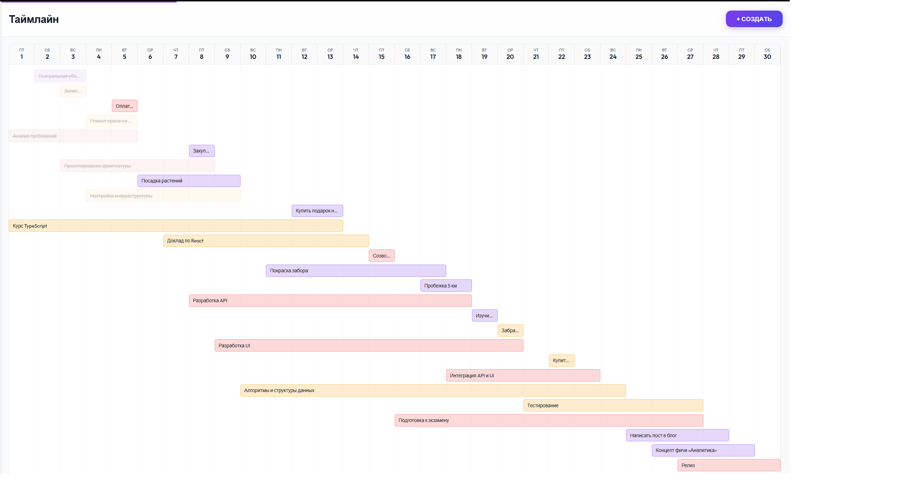
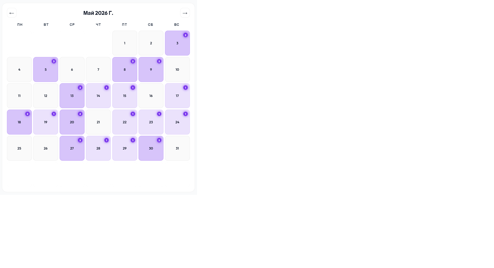

<div align="center">
  
  <h1 align="center">Nox</h1>
  <p align="center">Дзен-фокус для ваших задач</p>
  <p align="center">
    <a href="https://github.com/sanK-63/nox-app/releases/latest"><strong>📦 Скачать последнюю версию »</strong></a>
    <br>
    <a href="https://sanK-63.github.io/nox-app/">Сайт проекта</a>
    ·
    <a href="https://sanK-63.github.io/nox-app/prez.html">Презентация</a>
  </p>
  <p align="center">
    
    
    
    
    
  </p>
</div>

---

**Nox** — кроссплатформенный таск-менеджер с русскоязычным интерфейсом, вдохновлённый минимализмом.  
Никакой рекламы, телеметрии и подписок. Только вы и ваши задачи.

## 🚀 Возможности

| | |
|---|---|
| **📋 Умное управление** | Приоритеты, дедлайны, проекты с подзадачами и прогресс-баром |
| **📅 Таймлайн (Gantt)** | 30-дневная диаграмма с разной длительностью задач и пересечениями |
| **📆 Календарь** | Цветовая нагрузка по приоритетам на месяц |
| **🔥 Хитмап активности** | GitHub-стиль: оси дней/месяцев, тултипы, 5 ступеней |
| **🏷️ Теги** | Many-to-many, 8 пресетов, цветная фильтрация в сайдбаре |
| **☁️ Google Sync** | OAuth 2.0, резервное копирование и восстановление через Google Drive |
| **⏱️ Pomodoro** | Встроенный 25-минутный таймер |
| **🔍 Поиск и фильтры** | Глобальный поиск, фильтры «В работе / Важные / Архив» |
| **🎨 Два режима** | Просмотр и редактирование с нулевым смещением вёрстки |
| **🔔 Уведомления** | Toast-система, оповещения о ближайших дедлайнах |
| **⌨️ Хоткеи** | `Ctrl+N` — новая задача, `Ctrl+F` — поиск, `Esc` — закрыть |

## 🖼️ Скриншоты

| | |
|---|---|
| **Главный экран** |  |
| **Таймлайн**    |  |
| **Календарь**   |  |

## 📦 Установка

### Готовый инсталлятор

Скачайте последний релиз:

```
https://github.com/sanK-63/nox-app/releases/latest/download/Nox.Task.Manager.Setup.2.0.0.exe
```

### Сборка из исходников

```bash
git clone https://github.com/sanK-63/nox-app.git
cd nox-app/my-tasks
npm install
npm run dev     # режим разработки
npm run dist    # сборка установщика
```

## 🛠️ Стек

| Слой | Технология |
|---|---|
| **Фреймворк** | Electron 41 + React 19 |
| **Сборка** | Vite 8 + vite-plugin-electron |
| **БД** | better-sqlite3 (локально) |
| **Синхронизация** | Google Drive API (googleapis) |
| **Упаковка** | electron-builder + NSIS |
| **Стили** | CSS-переменные, Outfit/Inter |

## 🔐 Безопасность

- Все данные хранятся локально в `%APPDATA%/my-tasks/tasks.db`
- Google Sync использует OAuth 2.0 — токены не покидают ваше устройство
- Никакой телеметрии, трекеров и внешних запросов
- Единственное сетевое подключение — Google API (опционально)

## 📄 Лицензия

MIT © 2026 sanK-63
